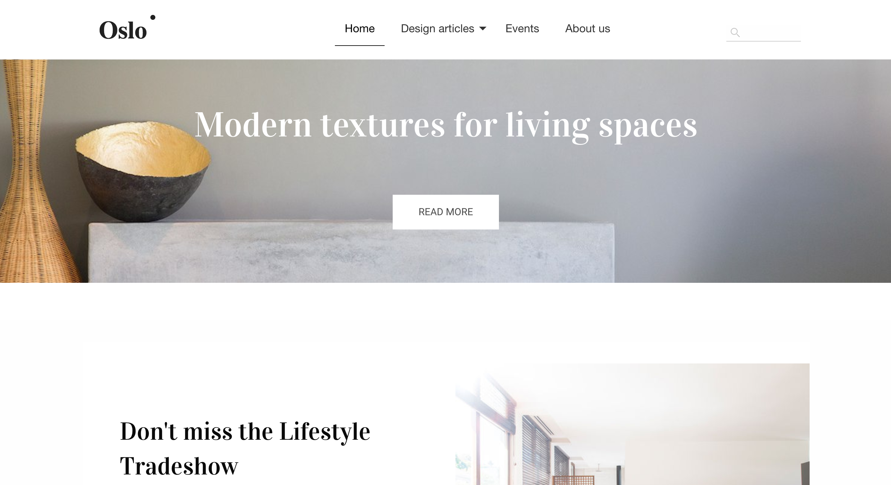

sample-site-vue
==============

As part of the Acoustic Content (formerly Watson Content Hub or WCH) sites feature a single page application is implemented to serve web sites. The Single Page Application is hosted on Acoustic Content and is stored as unmanaged assets. It leverages a set of content types, pages, categories, ... to render the Oslo sample application. The default single page application was implemented with Angular. The artifacts stored in WCH for Oslo are independent of the single page application. 
This sample contains the Single Page Site Application implemented with vue.js instead of the default angular site application. You can find more information about the default site application implemented with angular here: 
[Angular site application](https://github.com/ibm-wch/wch-site-application/).
You can replace the default single page application with the vue.js implementations in this repository. Note that this will overlay the default Angular based application with the vue.js implementation.
See the topic on Restoring the default Angular based application in case you want to switch back.
Update: At the beginning of April we have added Search functionality to the Vue Site SPA and also support now the ability to hide a page from the
navigation.



Getting started
------------
These are the instructions for setting up and deploying the Vue SPA.


Running Locally
-------
1. After cloning this repository, run `npm install` at the root directory.
2. In **src/Constants.js**, replace the following two values with the corresponding values from WCH Hub information modal. (User display name > Hub information)
    ```
    DOMAIN_NAME: 'your-domain-name.com'
    CONTENT_HUB_ID: '0000000-0000-0000-0000-000000000000'
    ```
3. In src/Constants.js, replace the siteID with the corresponding value from Website > YOUR SITE NAME > Detail button(->) > ID. The default siteID is default.
   ```
   SITE_ID: 'default'
   ```
4. Make sure that CORS is enabled on your Watson Content Hub tenant to allow localhost.
5. Start the local server:
   * From within the root directory, run `npm start`.
   * The SPA will be rendered at: http://localhost:4201

Layout gallery layout tools
-------------
Use the `npm run start-dev-tools` command to load the developer tools UI. Read more [here](https://www.npmjs.com/package/wch-site-developer-tools).


CLI Layout Generation
-------------
Example usage to add CONTENT-TYPE-NAME:

1. create a CONTENT-TYPE-NAME content type on wch

2. run `npm run create-layout -- --type "CONTENT-TYPE-NAME"`

   the npm command simply runs the following:
- `wchtools pull -tlmIv --dir src/wchLayouts` which pulls the layout info (layout, layout-mapping, and type json files)  
- `ibm-wch-sdk-cli create layout --data src/wchLayouts --scss --vue --src . "--type" "CONTENT-TYPE-NAME"` which creates the CONTENT-TYPE-NAME layout files (layout and layout-mapping json files, boilerplate vue template, blank scss file, and updated registration.js for Vue.Component() calls)

3. push the layout and layout-mapping json files: `wchtools push -tlmIv --dir src/wchLayouts` (perhaps I should add this to either the create-layout command or build-deploy, imo it should be in create-layout, but angular repo has the behavior in build-deploy)

4. make any customizations to the vue/scss and then `npm run build-deploy`

5. add desired content on wch
   
Deploying to Content Hub
-------
1. Install the latest version of [wchtools-cli](https://github.com/ibm-wch/wchtools-cli).
Windows: npm install -g wchtools-cli
Linux/Mac: sudo npm install -g wchtools-cli 
   * Note: make sure that you have initialized wchtools with your user and tenant API URL. You will be prompted for your user password when deploying to the tenant. For more information, refer to [wchtools-cli](https://github.com/ibm-wch/wchtools-cli).
2. In case you updated **src/Constants.js** with the tenant information for running locally comment the change again.
3. From the root directory, run `npm run build` and `npm run deploy`.


Changing the default (home) route
-------
The default route to load is set to `/home`. In order to change this:
1. Open **src/app.js** and find the line of code that specifies the `routes` object in the VueRouter: 
```
routes: [
   {path: '/', redirect: '/home'},
   {path: '/error', name: 'error', component: ErrorPage, props: true},
   {path: '/*/*', component: WchPage},
   {path: '/*', component: WchPage }
]
```
2. Change `{path: '/', redirect: '/home'}` to redirect to the new route.


Alternate SDK files of note
-------------

### index.js

Set of javascript functions primarily for calling WCH APIs. Also includes some
helper functions for working with images & videos, and fetching content IDs
associated with routes, and vice versa. All functions are individually exported
to take advantage of tree shaking. Data from WCH is now stored in a centralized
store that can be read from different components. This has the advantage of
de-coupling the components from the data loading, allowing for things like live
updates when data changes.

### wchPage.vue

A Vue component that gets served by all routes. Before each route gets set, it
determines the content ID of the associated page, then sets its template to be
the component that corresponds with the content's selected layout, or content
type respectively.

### wchContent.vue

A Vue component extremely similar to that of the wchPage, although not plugged
into the router. Takes a content ID as a prop, fetches the corresponding
content and sets its template to be the component that matches the content's
selected layout or content type respectively.


Check which SPA framework is deployed
------------
To verify if the site is running the React or Vue SPA, load the live site and search the browser console for 
"SPA framework". 


Limitations and Disclaimers
-------------
* This sample is intended primarily to demonstrate how the Content Hub delivery APIs can be used with any SPA framework.
* This SPA sample and the small Flux SDK (https://github.com/acoustic-content-samples/wch-flux-sdk) it uses are available as-is and do not necessarily represent recommended coding best practices. Also note that this sample may not be updated to use the latest versions dependency libraries.
* The focus of this sample is on rendering. Draft content may not always render correctly in preview. If draft content does not appear automatically, try refreshing the site preview.
* The CLI layout generation tool does not support the 'multiple' option for elements.


Restoring the default Angular based application
-------------
Clone the [Angular site application](https://github.com/ibm-wch/wch-site-application/) , trigger a build and push to your tenant to overlay the vue.js site application sample.
